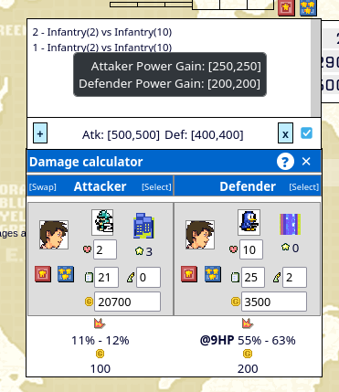
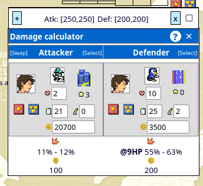

# AWBW PowerMeter Sheet

A quick way to calculate the total powermeter gain from multiple engagements. The script have two hotkeys:

- <kbd>x</kbd> for adding the engagement to the list.
- <kbd>x</kbd> + <kbd>Shift</kbd> for removing the last engagement from the list.




# Tampermonkey scripts hot reload

This is an experiment and a demo to explore live reloading for tampermonkey scripts. Run `bun run dev` to start.

## Tampermonkey Side

```js
// ==UserScript==
// @name         Scratchpad-LiveReload
// @namespace    https://awbw.amarriner.com/
// @version      0.1
// @description  This is an experiment and a demo to explore live reloading for tampermonkey scripts.
// @author       yhaidar
// @match        https://awbw.amarriner.com/game.php?games_id=*
// @match        https://awbw.amarriner.com/moveplanner.php?*
// @icon         https://awbw.amarriner.com/favicon.ico
// @require      http://localhost:8088/live-reload.js
// @grant        none
// @run-at       document-idle
// @license      MIT
// ==/UserScript==

```

## Install

Run `bun run build` and copy the generated `dist/script.js` file into tampermonkey like so:

```js
// ==UserScript==
// @name         AWBW PowerMeter Sheet
// @namespace    https://awbw.amarriner.com/
// @version      0.1
// @description  A quick way to calculate the total powermeter gain from multiple engagements.
// @author       yhaidar
// @match        https://awbw.amarriner.com/game.php?games_id=*
// @match        https://awbw.amarriner.com/moveplanner.php?*
// @icon         https://awbw.amarriner.com/favicon.ico
// @grant        none
// @run-at       document-idle
// @license      MIT
// ==/UserScript==

// Copy the content of "dist/script.js" here
```